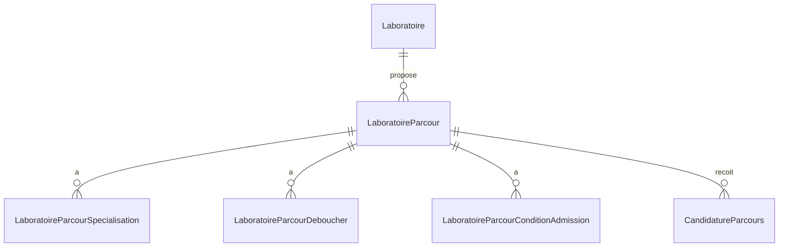

# UNA - Système de Gestion de Laboratoire Universitaire

## Vue d'ensemble

UNA est une application web complète pour la gestion d'un laboratoire universitaire, comprenant la gestion des chercheurs, des parcours de formation, des publications de recherche, des partenariats, et un système de candidature dynamique. Le projet utilise Django REST Framework pour le backend et React avec TypeScript pour le frontend.

## 🚀 Fonctionnalités Principales

### 1. Gestion des Chercheurs
- **Affichage dynamique de l'équipe** : Interface responsive avec données en temps réel
- **Profils détaillés** : Biographies, domaines d'expertise, publications, recherches actuelles
- **Réseaux sociaux** : Intégration des profils professionnels (LinkedIn, ResearchGate, ORCID, etc.)
- **Recherche et filtrage** : Recherche par nom, poste ou domaine d'expertise
- **Gestion des diplômes** : Historique académique des chercheurs

### 2. Gestion des Laboratoires
- **Informations complètes** : Nom, logo, UFR, type de laboratoire
- **Présentation** : Descriptions, missions, budgets annuels
- **Partenariats** : Gestion des collaborations académiques et industrielles
- **Actualités** : Système de news et publications du laboratoire

### 3. Gestion des Parcours de Formation
- **Parcours dynamiques** : Liste des formations liées au laboratoire
- **Informations détaillées** : Spécialisations, débouchés, conditions d'admission
- **États de gestion** : Loading, erreur, données vides avec interfaces appropriées
- **Gestion des étudiants** : Nombre maximum, durée de formation

### 4. Système de Recherche et Publications
- **Gestion des projets** : Suivi des recherches en cours, planifiées et terminées
- **Publications scientifiques** : Gestion des articles, DOI, facteur d'impact
- **Citations** : Suivi des citations et mots-clés
- **Réalisations** : Documentation des résultats et impacts
- **Financement** : Gestion des budgets et sources de financement

### 5. Système de Candidature Dynamique 🆕
- **Formulaire multi-étapes** : Interface progressive en 4 étapes
- **Validation complète** : Validation en temps réel avec feedback utilisateur
- **Upload de documents** : Support PDF avec prévisualisation
- **Intégration backend** : Envoi direct vers l'API Django

### 6. Gestion des Contacts et Communication
- **Contacts laboratoires** : Informations de contact complètes
- **Horaires d'ouverture** : Gestion des plannings
- **Messages de contact** : Système de messagerie avec priorités
- **Newsletter** : Abonnement et gestion des communications

## 📁 Structure du Projet

```
una/
├── backand/                           # API Django REST Framework
│   ├── api/
│   │   ├── models.py                  # Modèles de données (25+ modèles)
│   │   ├── serializers/               # Serializers API
│   │   │   ├── chercheur_serializers.py
│   │   │   ├── laboratoire_serializers.py
│   │   │   ├── publication_serializers.py
│   │   │   └── contact_serializers.py
│   │   ├── views.py                   # Vues API (ViewSets)
│   │   ├── services.py                # Services métier (Email, etc.)
│   │   ├── admin.py                   # Interface d'administration
│   │   ├── urls.py                    # Configuration des URLs
│   │   └── migrations/                # Migrations de base de données
│   ├── backand/
│   │   ├── settings.py                # Configuration Django
│   │   ├── urls.py                    # URLs principales
│   │   └── wsgi.py                    # Configuration WSGI
│   ├── manage.py                      # Gestionnaire Django
│   ├── db.sqlite3                     # Base de données SQLite
│   └── logs/                          # Fichiers de logs
├── frontend/                          # Application React TypeScript
│   ├── src/
│   │   ├── components/                # Composants React (50+ composants)
│   │   │   ├── ui/                    # Composants shadcn/ui
│   │   │   ├── Hero.tsx               # Section héro
│   │   │   ├── Navigation.tsx         # Navigation principale
│   │   │   ├── Team.tsx               # Équipe de chercheurs
│   │   │   ├── Publications.tsx       # Publications
│   │   │   ├── ApplicationModal.tsx   # Modal de candidature
│   │   │   └── ...                    # Autres composants
│   │   ├── pages/                     # Pages de l'application (15 pages)
│   │   │   ├── Index.tsx              # Page d'accueil
│   │   │   ├── Team.tsx               # Page équipe
│   │   │   ├── Research.tsx           # Page recherche
│   │   │   ├── Publications.tsx       # Page publications
│   │   │   └── ...                    # Autres pages
│   │   ├── hooks/                     # Hooks personnalisés (12 hooks)
│   │   │   ├── useChercheurs.ts       # Hook chercheurs
│   │   │   ├── useCandidature.ts      # Hook candidatures
│   │   │   ├── useLaboratoires.ts     # Hook laboratoires
│   │   │   └── ...                    # Autres hooks
│   │   ├── config/                    # Configuration
│   │   │   └── ApiConfig.ts           # Configuration API
│   │   ├── types/                     # Types TypeScript
│   │   ├── services/                  # Services API
│   │   └── constants/                 # Constantes
│   ├── public/                        # Fichiers statiques
│   ├── package.json                   # Dépendances Node.js
│   ├── vite.config.ts                 # Configuration Vite
│   └── tailwind.config.ts             # Configuration Tailwind
├── env/                               # Environnement virtuel Python
└── README.md                          # Documentation principale
```

## 🛠️ Technologies Utilisées

### Backend
- **Django 5.2.6** : Framework web Python
- **Django REST Framework 3.16.1** : API REST
- **SQLite** : Base de données (développement)
- **Django CORS Headers 4.8.0** : Gestion CORS
- **Pillow 11.3.0** : Traitement d'images
- **python-dotenv 1.1.1** : Gestion des variables d'environnement

### Frontend
- **React 18.3.1** : Bibliothèque UI
- **TypeScript 5.5.3** : Typage statique
- **Vite 7.1.4** : Build tool moderne
- **Tailwind CSS 3.4.11** : Framework CSS
- **shadcn/ui** : Composants UI (Radix UI primitives)
- **Lucide React 0.462.0** : Icônes
- **Sonner 1.5.0** : Notifications toast
- **React Router DOM 6.26.2** : Routage
- **React Hook Form 7.53.0** : Gestion des formulaires
- **Zod 3.23.8** : Validation de schémas
- **TanStack Query 5.56.2** : Gestion d'état serveur
- **Recharts 2.12.7** : Graphiques et visualisations

## 🚀 Installation et Configuration

### Prérequis
- Python 3.8+
- Node.js 16+
- npm ou yarn

### Installation du Backend

```bash
# 1. Naviguer vers le dossier backend
cd backand

# 2. Créer un environnement virtuel
python -m venv env
source env/bin/activate  # Linux/Mac
# ou
env\Scripts\activate     # Windows

# 3. Installer les dépendances
pip install -r requirements.txt

# 4. Appliquer les migrations
python manage.py makemigrations
python manage.py migrate

# 5. Créer un superutilisateur (optionnel)
python manage.py createsuperuser

# 6. Démarrer le serveur
python manage.py runserver
```

### Installation du Frontend

```bash
# 1. Naviguer vers le dossier frontend
cd frontend

# 2. Installer les dépendances
npm install

# 3. Démarrer le serveur de développement
npm run dev
```

## 🔧 Configuration API

La configuration de l'API se trouve dans `frontend/src/config/ApiConfig.ts` :

```typescript
export const ApiConfig = {
  BASE_URL: 'http://localhost:8000/api',
  ENDPOINTS: {
    CHERCHEURS: '/chercheurs/',
    CHERCHEUR_DETAIL: (id: number) => `/chercheurs/${id}/`,
    PARCOURS: '/parcours/',
    PARCOURS_DETAIL: (id: number) => `/parcours/${id}/`,
    CANDIDATURES: '/candidatures/',
    CANDIDATURE_DETAIL: (id: number) => `/candidatures/${id}/`,
  }
};
```

## 📋 Modèles de Données Principaux

### Chercheurs et Équipe
- **Chercheur** : Informations personnelles et professionnelles
- **ChercheurDiplome** : Historique académique des chercheurs
- **ChercheurDomaineExpertise** : Domaines de spécialisation
- **ChercheurPoste** : Postes et rôles dans le laboratoire
- **ChercheurReseau** : Réseaux sociaux et contacts professionnels
- **ChercheurMot** : Messages et citations des chercheurs

### Laboratoires et Organisation
- **Laboratoire** : Informations principales (nom, logo, UFR, type)
- **TypeLaboratoire** : Classification des types de laboratoires
- **LaboratoireDomaine** : Domaines de recherche du laboratoire
- **LaboratoirePresentation** : Présentations et descriptions
- **LaboratoireMission** : Missions, budgets et objectifs
- **LaboratoireSlider** : Contenu de présentation par page

### Formations et Parcours
- **LaboratoireParcour** : Parcours de formation proposés
- **LaboratoireParcourSpecialisation** : Spécialisations des parcours
- **LaboratoireParcourDeboucher** : Débouchés professionnels
- **LaboratoireParcourConditionAdmission** : Conditions d'admission

### Recherche et Publications
- **Recherche** : Projets de recherche (statut, financement, dates)
- **RechercheChercheur** : Équipes de recherche et rôles
- **RecherchePhase** : Phases de développement des projets
- **RechercheChronologie** : Planning et jalons des projets
- **RecherchePublication** : Publications scientifiques
- **RecherchePublicationCitation** : Citations des publications
- **RecherchePublicationMotCle** : Mots-clés des publications
- **RechercheRealisation** : Réalisations et impacts
- **RechercheObjectif** : Objectifs des projets de recherche
- **RecherchePartenaire** : Partenaires et financements

### Partenariats
- **Partenaire** : Informations sur les partenaires
- **LaboratoirePartenaire** : Relations laboratoire-partenaires
- **RecherchePartenaire** : Collaborations sur les projets

### Candidatures 🆕
- **CandidatureParcours** : Candidatures aux parcours de formation
  - **Informations personnelles** : Nom, prénom, date de naissance, nationalité
  - **Contact** : Téléphone, email, adresse complète
  - **Académique** : Niveau d'étude, établissement, moyenne, année d'obtention
  - **Documents** : CV, lettre de motivation, relevés de notes, diplôme
  - **Projet** : Motivation principale, projet professionnel, expérience recherche
  - **Suivi** : Statut candidature, commentaires admin, note d'évaluation

### Communication et Contact
- **ContactLaboratoire** : Informations de contact des laboratoires
- **HoraireLaboratoire** : Horaires d'ouverture
- **MessageContact** : Messages envoyés aux laboratoires
- **LaboratoireNew** : Actualités et news du laboratoire
- **Type** : Types de contenu et classifications

## 🎯 Nouvelle Fonctionnalité : Candidature Dynamique

### Formulaire Multi-Étapes

#### Étape 1 : Informations Personnelles
- Nom de famille, Prénom
- Date de naissance, Lieu de naissance  
- Nationalité

#### Étape 2 : Informations de Contact
- Téléphone, Email
- Adresse complète, Ville, Pays de résidence

#### Étape 3 : Informations Académiques et Documents
- Niveau d'étude actuel (Licence, Master 1/2, Doctorat)
- Établissement d'origine, Filière d'étude
- Moyenne générale, Année d'obtention du diplôme
- Upload de documents PDF : CV, Lettre de motivation, Relevés de notes, Diplôme

### Validation et Sécurité
- **Validation temps réel** : Feedback immédiat sur les erreurs
- **Validation d'âge** : Minimum 18 ans requis
- **Format de fichiers** : PDF uniquement pour les documents
- **Limites de caractères** : Contrôle de la longueur des textes
- **Validation email** : Format email valide requis

## 🔗 Intégration Frontend-Backend

### Hooks Personnalisés
- **`useChercheurs()`** : Gestion des données chercheurs
- **`useParcours()`** : Gestion des parcours de formation
- **`useCandidature()`** : Gestion du formulaire de candidature

### Gestion des États
- **Loading** : Indicateurs de chargement
- **Error** : Gestion et affichage des erreurs
- **Empty** : États vides avec messages appropriés
- **Success** : Confirmations d'actions réussies

## 🎨 Interface Utilisateur

### Design System
- **Composants shadcn/ui** : Interface cohérente et moderne
- **Responsive design** : Adaptation mobile et desktop
- **Dark/Light mode** : Support des thèmes
- **Animations** : Transitions fluides avec Tailwind

### Pages Frontend Disponibles
- **Index** : Page d'accueil avec présentation générale
- **About** : À propos du laboratoire
- **Team** : Équipe de chercheurs avec profils détaillés
- **TeamMemberDetail** : Profil individuel d'un chercheur
- **Level** : Parcours de formation disponibles
- **Research** : Projets de recherche
- **ResearchDetail** : Détails d'un projet de recherche
- **Publications** : Publications scientifiques
- **PublicationDetail** : Détail d'une publication
- **News** : Actualités du laboratoire
- **NewsDetail** : Détail d'une actualité
- **Director** : Page du directeur
- **DeclarationDetail** : Déclarations et documents officiels
- **Contact** : Informations de contact
- **NotFound** : Page d'erreur 404

### Navigation
- **Progress bar** : Indicateur de progression dans les formulaires
- **Breadcrumbs** : Navigation contextuelle
- **Modal dialogs** : Interactions non-intrusives

## 🧪 Tests et Validation

### Tests d'Intégration
- Script de test API : `test_publications_api.py`
- Validation des endpoints
- Tests de performance

### Tests Frontend
```bash
# Tests unitaires
npm run test

# Tests e2e (si configurés)
npm run test:e2e
```

## 📚 Documentation API

### Endpoints Principaux

#### Chercheurs
- `GET /api/chercheurs/` : Liste des chercheurs
- `GET /api/chercheurs/{id}/` : Détails d'un chercheur

#### Laboratoires
- `GET /api/laboratoires/` : Liste des laboratoires
- `GET /api/laboratoires/{id}/` : Détails d'un laboratoire
- `GET /api/laboratoires/{id}/parcours/` : Parcours d'un laboratoire

#### Parcours
- `GET /api/parcours/` : Liste des parcours
- `GET /api/parcours/{id}/` : Détails d'un parcours

#### Publications de Recherche
- `GET /api/publications/` : Liste des publications
- `GET /api/publications/{id}/` : Détails d'une publication

#### Candidatures 🆕
- `POST /api/candidatures/` : Créer une candidature
- `GET /api/candidatures/` : Liste des candidatures (admin)
- `GET /api/candidatures/{id}/` : Détails d'une candidature
- `PUT /api/candidatures/{id}/` : Modifier une candidature
- `DELETE /api/candidatures/{id}/` : Supprimer une candidature

#### Contacts et Communication
- `GET /api/contacts/` : Liste des contacts laboratoires
- `GET /api/contacts/{id}/` : Détails d'un contact
- `GET /api/contacts/{id}/horaires/` : Horaires d'un contact
- `POST /api/messages/` : Envoyer un message de contact
- `GET /api/messages/` : Liste des messages (admin)

## 🧩 Serializers (DRF)

Cette section décrit les principaux serializers et ce qu'ils exposent dans les réponses JSON de l'API.

### Chercheurs

- `ChercheurListSerializer` (`backand/api/serializers/chercheur_serializers.py`)
  - Champs: `id`, `nom`, `prenom`, `photo_url`, `poste_principal`, `biographie`, `specialite`, `email`, `reseaux[]`
  - Usage: liste (`GET /api/chercheurs/`)
  - Exemple:
  ```json
  {
    "id": 1,
    "nom": "Doe",
    "prenom": "Jane",
    "photo_url": "http://localhost:8000/media/static/photoTeam/jane.jpg",
    "poste_principal": "Directrice",
    "biographie": "…",
    "specialite": "Intelligence Artificielle",
    "email": "jane.doe@univ.ci",
    "reseaux": [{ "id": 10, "type_reseau": "LinkedIn", "contact": "https://…" }]
  }
  ```

- `ChercheurSerializer` (détail)
  - Champs: `id`, `nom`, `prenom`, `biographie`, `photo_url`, `statut`, `date_embauche`, `bureau`,
    `reseaux[]`, `postes[]`, `domaines_expertise[]`, `diplomes[]`, `publications[]`, `recherches_actuelles[]`
  - Usage: détail (`GET /api/chercheurs/{id}/`)
  - Notes: `reseaux`, `postes`, `domaines_expertise`, `diplomes`, `publications`, `recherches_actuelles` sont calculés via `SerializerMethodField` avec jointures applicatives.

### Parcours

- `LaboratoireParcourListSerializer` (`backand/api/serializers/laboratoire_serializers.py`)
  - Champs: `id`, `nom_parour`, `date_creation`, `description`, `duree_formation`, `nombre_etudiant_max`, `statu`,
    `laboratoire_nom`, `laboratoire_ufr`
  - Usage: liste (`GET /api/parcours/`)
  - Exemple:
  ```json
  {
    "id": 2,
    "nom_parour": "Master IA",
    "date_creation": "2024-01-10",
    "description": "…",
    "duree_formation": 2,
    "nombre_etudiant_max": 30,
    "statu": "Actif",
    "laboratoire_nom": "Labo Informatique",
    "laboratoire_ufr": "UFR-SET"
  }
  ```

- `LaboratoireParcourSerializer` (détail)
  - Champs: `id`, `nom_parour`, `date_creation`, `description`, `duree_formation`, `nombre_etudiant_max`, `statu`,
    `laboratoire{ id, nom, logo_url, ufr, date_de_creation, type_laboratoire{ id, type_labo } }`,
    `conditions_admission[]`, `debouches[]`, `specialisations[]`
  - Usage: détail (`GET /api/parcours/{id}/`)
  - Notes: les listes annexes sont calculées via `SerializerMethodField`.

### Candidatures

- `CandidatureParcoursCreateSerializer` (création)
  - Usage: `POST /api/candidatures/`
  - Exclut en écriture: `statut_candidature`, `commentaires_admin`, `note_evaluation`, `date_soumission`, `date_derniere_modification`
  - Validation fichiers: `cv_candidat`, `lettre_motivation`, `releves_notes` (formats acceptés: PDF, DOC, DOCX)
  - Exemple `multipart/form-data` (représentation JSON indicative):
  ```json
  {
    "nom_candidat": "Kouamé",
    "prenom_candidat": "Ali",
    "date_naissance": "1999-05-12",
    "lieu_naissance": "Abidjan",
    "nationalite": "Côte d'Ivoire",
    "telephone_candidat": "+22501020304",
    "email_candidat": "ali.kouame@example.com",
    "adresse_complete": "…",
    "ville_residence": "Abidjan",
    "pays_residence": "CI",
    "niveau_etude_actuel": "Master 1",
    "etablissement_origine": "UNA",
    "filiere_etude": "Informatique",
    "moyenne_generale": 15.5,
    "annee_obtention_diplome": 2023,
    "id_parcours": 2,
    "cv_candidat": "<fichier>",
    "lettre_motivation": "<fichier>",
    "releves_notes": "<fichier>",
    "diplome_obtenu": "<fichier|optionnel>"
  }
  ```

- `CandidatureParcoursSerializer` (lecture)
  - Champs: tous les champs de la candidature, plus `parcours_nom`, `laboratoire_nom`, `nom_complet`, `age`
  - Usage: `GET /api/candidatures/` (admin), `GET /api/candidatures/{id}/`

### Autres serializers utiles

### `frontend/src/hooks/useCandidature.ts`
- **useCandidature(parcoursId)**
  - Gère: `formData`, `errors`, `isLoading`, `isSubmitted`.
  - Méthodes: `handleChange`, `validateStep`, `handleSubmit`, `resetForm`.
  - Soumission: `POST /api/candidatures/` avec `FormData` (fichiers: `cv_candidat`, `lettre_motivation`, `releves_notes`, `diplome_obtenu?`).
  - Validations: âge ≥ 16 ans, email, bornes moyenne (0–25), année ∈ [1980, now+5], présence des fichiers requis.

### `frontend/src/hooks/useLaboratoires.ts`
- **useLaboratoires(searchTerm?)**
  - Retourne: `{ laboratoires, loading, error, refetch }`
  - Appelle: `GET /api/laboratoires/` (+ `?search=` si fourni)
- **useLaboratoireDetail(id)**
  - Retourne: `{ laboratoire, loading, error, refetch }`
  - Appelle: `GET /api/laboratoires/{id}/`
- **useLaboratoireParcours(laboratoireId)**
  - Retourne: `{ parcours, loading, error, refetch }`
  - Appelle: `GET /api/laboratoires/{id}/parcours/`

### `frontend/src/hooks/useNewsletter.tsx`
- **useNewsletter()**
  - Gère un abonnement newsletter simulé côté client.
  - Retourne: `{ email, isLoading, error, setEmail, subscribe }` avec validations basiques.

## 🔐 Administration

### Interface Admin Django
Accessible sur `http://localhost:8000/admin/` avec :
- **Gestion des Chercheurs** : Profils, diplômes, domaines d'expertise, réseaux sociaux
- **Gestion des Laboratoires** : Informations, présentations, missions, budgets
- **Gestion des Parcours** : Formations, spécialisations, conditions d'admission
- **Gestion de la Recherche** : Projets, publications, citations, réalisations
- **Candidatures et Formations** : Suivi des candidatures avec filtres et recherche
- **Partenariats** : Gestion des collaborations et financements
- **Configuration Système** : Pages, types, et paramètres généraux
- **Communication** : Messages de contact, horaires, actualités

### Permissions
- **Publique** : Consultation des chercheurs, parcours, publications, actualités
- **Candidats** : Soumission de candidatures
- **Admin** : Gestion complète du système avec interface organisée par groupes

## 🐛 Dépannage

### Problèmes Courants

1. **CORS Error**
   ```python
   # Dans settings.py
   CORS_ALLOWED_ORIGINS = [
       "http://localhost:8080",
       "http://127.0.0.1:8080",
   ]
   ```

2. **API non accessible**
   - Vérifier que le serveur Django fonctionne : `http://localhost:8000/api/`
   - Contrôler la configuration dans `ApiConfig.ts`

3. **Upload de fichiers ne fonctionne pas**
   - Vérifier les permissions de dossier `static/`
   - Contrôler la configuration `MEDIA_URL` et `MEDIA_ROOT`

## 🚀 Déploiement

### Production Backend
```bash
# Variables d'environnement
export DEBUG=False
export SECRET_KEY=your-secret-key
export DATABASE_URL=your-database-url

# Collecte des fichiers statiques
python manage.py collectstatic

# Démarrage avec Gunicorn
gunicorn backand.wsgi:application
```

### Production Frontend
```bash
# Build de production
npm run build

# Les fichiers sont générés dans dist/
```

## 🤝 Contribution

### Standards de Code
- **Noms en français** : Variables et fonctions en français
- **TypeScript strict** : Typage complet
- **ESLint/Prettier** : Formatage automatique
- **Conventions Django** : PEP 8 pour Python

### Workflow Git
1. Fork du projet
2. Création d'une branche feature
3. Commits descriptifs en français
4. Pull Request avec description détaillée

## 📝 Changelog

### Version 3.0.0 - Système Complet de Gestion
- ✨ **Nouveau** : Gestion complète des laboratoires et partenariats
- ✨ **Nouveau** : Système de recherche et publications scientifiques
- ✨ **Nouveau** : Gestion des contacts et communication
- ✨ **Nouveau** : Interface admin organisée par groupes fonctionnels
- ✨ **Nouveau** : Système d'actualités et news
- 🔧 **Amélioration** : 25+ modèles de données intégrés
- 🔧 **Amélioration** : API REST étendue avec 6 ViewSets principaux
- 🔧 **Amélioration** : Interface frontend avec 15 pages complètes

### Version 2.0.0 - Candidature Dynamique
- ✨ **Nouveau** : Système de candidature multi-étapes
- ✨ **Nouveau** : Upload de documents PDF
- ✨ **Nouveau** : Validation complète des formulaires
- ✨ **Nouveau** : Interface admin pour les candidatures
- 🔧 **Amélioration** : Gestion d'état unifiée
- 🔧 **Amélioration** : Configuration API étendue

### Version 1.0.0 - Base
- ✨ Gestion des chercheurs
- ✨ Affichage des parcours
- ✨ Interface responsive
- ✨ API REST complète

## 📞 Support

Pour toute question ou problème :
1. Consulter cette documentation
2. Vérifier les logs Django et React
3. Contrôler la console navigateur pour les erreurs JavaScript

## ⚙️ Configuration d'environnement (recommandée)

### Frontend (.env)
- Créez `frontend/.env.local` (ou `.env`) pour rendre la base URL configurable selon l'environnement.

```env
VITE_API_BASE_URL=http://localhost:8000/api
```

- Adaptez `frontend/src/config/ApiConfig.ts` pour lire la variable d'environnement, avec repli par défaut:

```ts
// Exemple: utilisez d'abord l'env, sinon fallback
const BASE = import.meta.env.VITE_API_BASE_URL || 'http://localhost:8000/api';
export const ApiConfig = {
  BASE_URL: BASE,
  // ... le reste inchangé
};
```

### Backend (CORS)
- Assurez-vous d'autoriser le port Vite (8080) dans `CORS_ALLOWED_ORIGINS`.
- Exemple mis à jour ci-dessus.

### Gitignore: environnement Python
- Évitez de versionner l'environnement virtuel Python.
- À la racine du projet, ajoutez dans `.gitignore`:

```gitignore
env/
*/env/
.venv/
*/.venv/
```

## 📤 Envoi de candidatures (multipart/form-data)

Le formulaire `ApplicationModal` envoie des fichiers (CV, lettre, relevés...). Il faut utiliser `FormData` et ne pas fixer `Content-Type: application/json`.

Bonnes pratiques côté frontend:
- Pour les requêtes avec fichiers, créez un `FormData` et ne renseignez pas l'en-tête `Content-Type` (le navigateur ajoute automatiquement le boundary multipart).
- Conservez `Accept: application/json` si besoin.

Exemple générique:

```ts
const fd = new FormData();
fd.append('nom_candidat', form.nom_candidat);
fd.append('cv_candidat', form.cv_candidat); // File
// ... autres champs

await fetch(`${ApiConfig.BASE_URL}/candidatures/`, {
  method: 'POST',
  body: fd,
  // ne pas mettre Content-Type ici
});
```

## 🚀 Optimisation des requêtes (scalabilité)

Sur la page `Level` (`frontend/src/components/Level.tsx`), chaque carte déclenche `useParcoursDetail(id)`. Si la liste grandit, cela multiplie les appels.

Recommandations:
- Utiliser `@tanstack/react-query` (déjà présent) pour:
  - Cache, déduplication, retries, invalidation.
- Charger les détails à la demande (accordion/drawer) au clic, au lieu de charger toutes les cartes.
- Alternativement, exposer un endpoint liste enrichie côté backend si acceptable.

## 📜 Scripts utiles

### Frontend (dans `frontend/`)
- `npm run dev` — démarre Vite sur `http://localhost:8080`
- `npm run build` — build de production (sortie dans `dist/`)
- `npm run preview` — prévisualisation du build
- `npm run lint` — linting ESLint

### Backend (dans `backand/`)
- `python manage.py runserver` — démarre l'API Django
- `python manage.py makemigrations && python manage.py migrate` — migrations
- `python manage.py createsuperuser` — création admin

## 🗺️ Schéma des relations principales (parcours et candidatures)



## 🔎 Cohérence de nommage

- Le dossier backend du dépôt est nommé `backand/` (et non `backend/`). La structure ci-dessus a été corrigée en conséquence. Pensez à mettre à jour vos scripts et documentation internes si besoin.

---

**Développé avec ❤️ pour l'université**